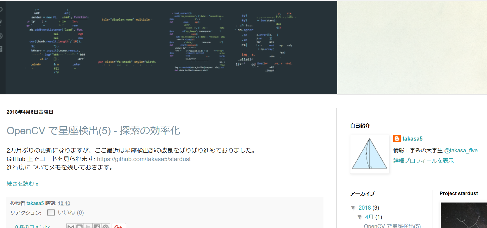
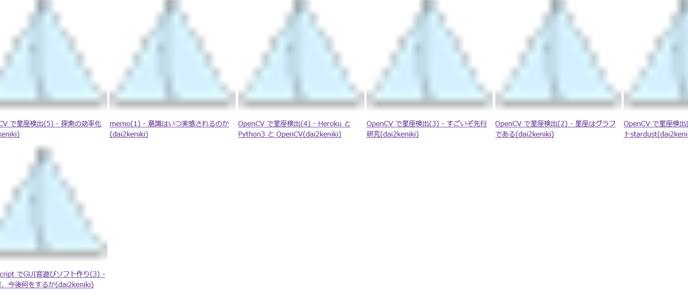

## my_patroller
If you patrol many Web site every day, my_patroller will help your patrol especially when visiting a blog site with both titles and images (and many annoying ads).

### Screenshots
Note that my blog is not a good example because update frequency is very slow, all of posts don't have image, and do NOT annoy!  
- This is my blog before being processed by my-patroller.  

  

- This is processed my blog.  


You can see all the posts with no scroll (and if they have image, you can see it at the same time).
This example use only a site, but you can add some sites and you can see all the sites in one page!

### Requirement
```
beautifulsoup4==4.6.0
Flask==0.12.2
```
### Preparation
my_patroller needs preparation because it doesn't know where contents(title/link/image) are. So you must let it know where them are by writing JSON file. example.json is an example of the JSON file.  
  
First, you must write ```"ua"``` key. It has a dict as value. With reference to example.json, fill your User-Agent in. If this is inaccurate, crawling doesn't work.
```
{
    "ua": {"User-Agent": "<Fill here>"}
}
```
Next, you must write site informations. Site information is:
```
{
    "<site-name-1>": {
        "url": "<site-url>",
        "next_url", "<continuation-of-url>",
        "page_origin": 1,
        "posts": [],
        "content": [],
        "title": [],
        "link": [],
        "image": []
    },
    "<site-name-2>" {
        ...
    }
}
```
If one of your favorite site has url such as "http://example.com" and the next page has "http://example.com/page-2.html", you can write:  
```
{
    "url": "http://example.com/",
    "next_url": "page-{}.html"
}
```
And if the next page has "http://example.com/page/2":
```
{
    "next_url": "page/{}"
}
```
```"page_origin"``` key is the number of the first page. In most cases, it is 1.
In the case of second page has url such as "http://example.com/page-1":
```
{
    "page_origin": 0
}
```

I'm sorry that I can't write according to this rule in example.json(my blog).  
  
Keys from ```"posts"``` to ```"image"``` are necessary for identify the position of contents. Open the inspector in your browser, investigate the element, and fill them.  
```"posts"``` must be filled with element that all the posts have. If all the posts are in ```<div class="date-outer"></div>```, you can write:
```
"posts": [
    {
        "elm": "div",
        "attrs": {"class": "date-outer"}
    }
]
```
Although the above example is sufficient, to make it more reliable, you can specify parent elements in order.
```
"posts": [
    {
        "elm": "div",
        "attrs": {"id": "Blog1"}
    },
    {
        "elm": "div",
        "attrs": {"class": "date-outer"}
    }
]
```
Next, you must specify where title/link/image is. If they are in a deep hierarchy and have the same parent element, you can write it in ```"content"```. You can leave ```"content"``` be empty list.  
In keys ```"title"```, ```"link"``` and ```"image"```, you can write as above but their last element has to has key ```"key"``` or ```"string"```. For example, my blog has following element:
```
<a href="https://takasa-5.blogspot.jp/2018/04/opencv-5.html">OpenCV で星座検出(5) - 探索の効率化</a>
```
After specifing this ```<a>```, if you want to get the link, write:
```
"link": [
    {
        "key": "href"
    }
]
```
and if you want to get the title:
```
"title": [
    {
        "string": "<something-you-like>"
    }
]
```
If you want to add the site which doesn't always have image in post (not recommended), you can write:
```
"image": [null]
```
```"date"``` and ```"date-format"``` is an optional key. If you add these, try to execute this program with option ```--dateorder``` or ```-d```. Then you can view it in chronological order.  
```"date"``` can be written like ```"title"``` and so on. If the date in your target site is written like follow:
```
5月 26, 2018
```
Then you have to write ```date-format``` like follow:
```
{
    "date-format": "%m月 %d, %Y"
}
```
This notation is in accordance with *datetime* module.

After completing the above troublesome preparations, you can spend comfortable days with my_patroller.

### Usage
```
python patrollr.py
```
And visit http://127.0.0.1:5000/ !